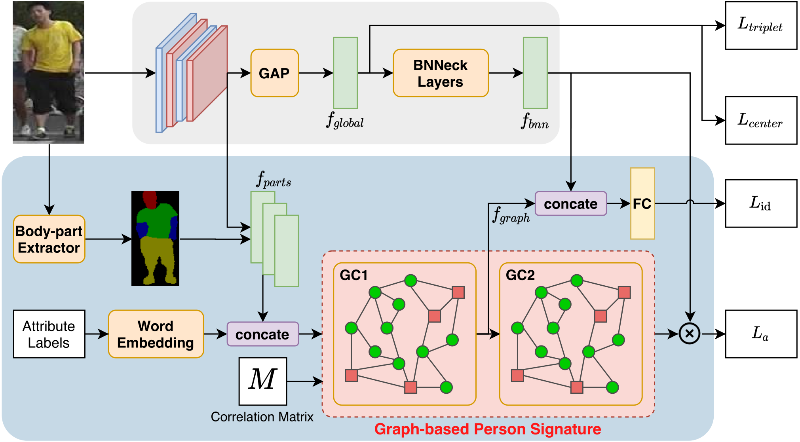

# Graph-based Person Signature for Person Re-Identifications (GPS)

This repository is the implementation of `GPS` for Person Re-Identifications task. Our model achieved **87.8**, **78.7** on mean Average Precision (mAP) and **95.2**, **88.2** on Cumulative Matching Characteristic (CMC) R-1 over Market1501 and DukeMTMC-ReID datasets, respectively. For the detail, please refer to [link](https://arxiv.org/pdf/2104.06770.pdf).

This repository is based on and inspired by @Hao Luo's [work](https://github.com/michuanhaohao/reid-strong-baseline). We sincerely thank for their sharing of the codes.
### Summary

* [The proposed framework](#the-proposed-framework)
* [Prerequisites](#prerequisites)
* [Datasets](#datasets)
* [Training](#training)
* [Testing](#testing)
* [Citation](#citation)
* [License](#license)
* [More information](#more-information)

### The proposed framework 



### Prerequisites

Python3

Please install dependence package by run following command:
```
pip install -r requirements.txt
```

### Datasets

**Market1501**

* The Market1501 original dataset can be downloaded via [link](https://www.kaggle.com/pengcw1/market-1501/data).

* The Market1501 attributes and body-part masks can be downloaded via [link](https://huggingface.co/datasets/aiozai/CVPRW2021_GPS/resolve/main/market1501_gps_att_release.zip).

* Additionally, a full version including all the above data is available [here](https://huggingface.co/datasets/aiozai/CVPRW2021_GPS/resolve/main/market1501_gps_full_release.zip). Downloading this version is sufficient.

* Extract the downloaded files to the `dataset/market1501_gps_release/` directory.

This directory is constructed as follow:   
```
|---dataset   
|---|---market1501_gps_release   
|---|---|---bounding_box_test
|---|---|---bounding_box_train
|---|---|---gt_bbox
|---|---|---gt_query
|---|---|---query
|---|---|---attribute
|---|---|---Masks
|---|---|---adj.pkl
|---|---|---glove.pkl
|---|---|---image_mask_path_dict.pkl
|---|---|...
```

**DukeMTMC-ReID**

* The DukeMTMC-ReID original dataset can be downloaded via [link](https://drive.google.com/u/0/uc?export=download&confirm=_Npo&id=1jjE85dRCMOgRtvJ5RQV9-Afs-2_5dY3O).

* The DukeMTMC-ReID attributes and body-part masks can be downloaded via [link](https://huggingface.co/datasets/aiozai/CVPRW2021_GPS/resolve/main/dukemtmc_gps_att_release.zip).

* Additionally, a full version including all the above data is available [here](https://huggingface.co/datasets/aiozai/CVPRW2021_GPS/resolve/main/dukemtmc_gps_full_release.zip). Downloading this version is sufficient.

* Extract the downloaded files to the `dataset/dukemtmc_gps_release/` directory.

This directory is constructed as follow:   
```
|---dataset   
|---|---dukemtmc_gps_release
|---|---|---bounding_box_test
|---|---|---bounding_box_train
|---|---|---query
|---|---|---attribute
|---|---|---Masks
|---|---|---adj.pkl
|---|---|---glove.pkl
|---|---|---image_mask_path_dict.pkl
|---|---|...
```

Thanks to Yutian Lin ([github](https://github.com/vana77)) for providing the Market1501 and DukeMTMC-ReID attributes.

### Training
You should download the pretrained weight of ResNet50 model via [link](https://download.pytorch.org/models/resnet50-19c8e357.pth) and put to `pretrained/resnet50-pretrained/` directory.

To train GPS model on **Market1501** dataset, please follow:
```
$ python train.py --config_file configs/market1501_gps_softmax_triplet_center.yml
```
To train GPS model on **DukeMTMC-ReID** dataset, please follow:
```
$ python train.py --config_file configs/dukemtmc_gps_softmax_triplet_center.yml
```
The training scores will be printed every epoch.


### Testing
In this repo, we include the pre-trained weight of `GPS_market1501` and `GPS_dukemtmc` models.

For `GPS_market1501` pretrained model. Please download the [link](https://huggingface.co/aiozai/CVPRW2021_GPS/resolve/main/GPS_market1501.pth) and move to `pretrained/` directory. The trained `GPS_market1501` model can be tested in Market1501 test split via: 
```
$ python test.py --config_file configs/market1501_gps_softmax_triplet_center.yml MODEL.PRETRAIN_CHOICE "('self')" TEST.WEIGHT "('pretrained/GPS_market1501.pth')"
```
For `GPS_dukemtmc` pretrained model. Please download the [link](https://huggingface.co/aiozai/CVPRW2021_GPS/resolve/main/GPS_dukemtmc.pth) and move to `pretrained`. The trained `GPS_dukemtmc` model can be tested in DukeMTMC-ReID test split via:
```
$ python test.py --config_file configs/dukemtmc_gps_softmax_triplet_center.yml MODEL.PRETRAIN_CHOICE "('self')" TEST.WEIGHT "('pretrained/GPS_dukemtmc.pth')"
```


### Citation

If you use this code as part of any published research, we'd really appreciate it if you could cite the following paper:

```
@InProceedings{Nguyen_2021_CVPR,
    author    = {Nguyen, Binh X. and Nguyen, Binh D. and Do, Tuong and Tjiputra, Erman and Tran, Quang D. and Nguyen, Anh},
    title     = {Graph-Based Person Signature for Person Re-Identifications},
    booktitle = {Proceedings of the IEEE/CVF Conference on Computer Vision and Pattern Recognition (CVPR) Workshops},
    month     = {June},
    year      = {2021},
    pages     = {3492-3501}
}
```

### License

MIT License

**AIOZ © 2021 All rights reserved.**

### More information

AIOZ AI Homepage: https://ai.aioz.io

AIOZ Network: https://aioz.network
